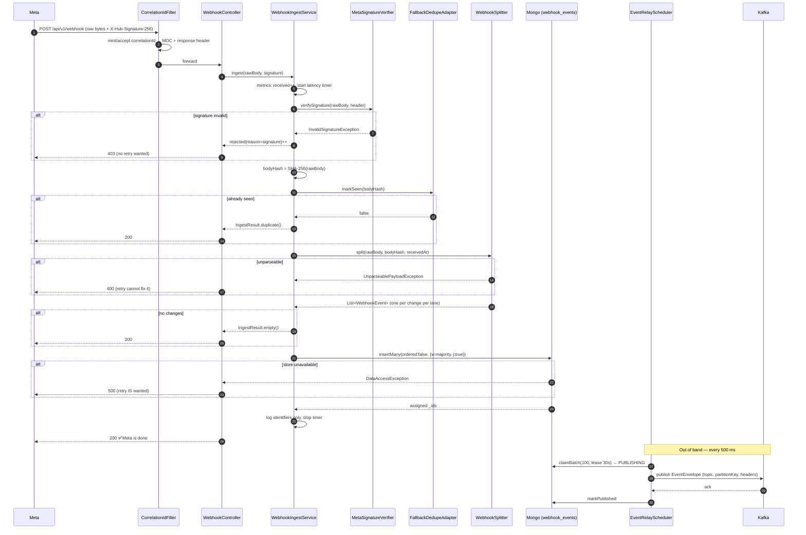

# Webhook Ingest Flow — end to end

Complete trace of a Meta WhatsApp callback through `webhook-service`, from TCP accept to Kafka acknowledgement, including every branch, status code and failure mode.

**Endpoint:** `POST /api/v1/webhook`
**Auth:** HMAC-SHA256 over the raw body, header `X-Hub-Signature-256`
**Contract:** answer 200 as close to unconditionally as possible; nothing is published to Kafka on this path.

---

## 0. Why the order is what it is

The pipeline runs **verify → dedupe → split → persist → respond**, and each position is deliberate:

- **Verify first** so no unauthenticated body ever reaches the parser or the database.
- **Dedupe before parsing** because hashing bytes is cheaper than walking JSON, and Meta redelivers the same body to every subscribed app.
- **Persist before responding**, because acknowledging before persisting silently loses events on an unclean shutdown that Meta will never send again.
- **Publish after responding**, because publishing inline would turn a broker blip into a Meta unsubscribe.

The 200 sits in exactly one place: **after the Mongo write is acknowledged, before any Kafka publish.**

---

## 1. Sequence



---

## 2. Step-by-step

### Step 1 — `CorrelationIdFilter`

Registered at `HIGHEST_PRECEDENCE` against `/*`.

- Reads `X-Correlation-Id`; if absent or blank, mints a `UUID.randomUUID()`.
- Puts it in the SLF4J `MDC` under `correlationId` and sets it on the response header.
- Removes it from the MDC in a `finally`.

Meta never sends one, so most webhook requests get a fresh id — which is still what joins the ingest log line to the relay log line for the same event.

**`InternalApiKeyFilter` does not run here.** It is registered only against `/api/v1/webhook-events` and `/api/v1/webhook-events/*`. Meta cannot send a private header, so the Meta-facing endpoints are authenticated by HMAC instead.

### Step 2 — `WebhookController.ingest`

```java
@PostMapping(consumes = MediaType.ALL_VALUE)
public ResponseEntity<Void> ingest(@RequestBody(required = false) byte[] rawBody,
                                   HttpServletRequest request)
```

Two details matter:

- **`byte[]`, not a DTO.** The HMAC is computed over the raw bytes; verifying a re-serialised body can never match because Jackson reorders keys and normalises whitespace. This is the single most common way to get this endpoint wrong.
- **`consumes = ALL_VALUE`.** A content-type mismatch must never produce a 415, which Meta would treat as a failure.

The signature is pulled from the configured header name (`webhook.meta.signature-header`, default `X-Hub-Signature-256`) rather than a hard-coded string.

### Step 3 — Metrics open

`WebhookIngestService.ingest` starts a `Timer.Sample` and increments `webhook.ingest.received`. The timer is stopped in a `finally`, so latency is recorded on **every** path including rejections. It measures arrival → durable write acknowledged.

### Step 4 — Signature verification (`MetaSignatureVerifier`)

Checks, in order:

1. If `webhook.meta.verify-signature` is `false` → return immediately. *(Local dev only; startup logs a loud warning.)*
2. No signing key configured → `InvalidSignatureException`. Startup validation prevents this; it is defence in depth against a hot config change.
3. Header null or blank → reject.
4. Header not prefixed `sha256=` → reject.
5. Remainder not valid hex → reject.
6. `HmacSHA256(appSecret, rawBody)` compared to the provided digest with **`MessageDigest.isEqual`** (constant time) → reject on mismatch.

A null body is hashed as `new byte[0]` rather than NPE-ing.

**On failure:** `webhook.ingest.rejected{reason=signature}` increments, the controller logs a warning with the remote address, and returns **403**. 403 is correct precisely because no retry is wanted — the request is not from Meta.

### Step 5 — Body hash (`BodyHasher`)

`HexFormat.of().formatHex(SHA-256(rawBody))`, null-safe. This one value serves two purposes: the dedupe key, and the `bodyHash` field stored on every resulting document (which is how you find every event that arrived in the same POST).

### Step 6 — Dedupe (`FallbackDedupeAdapter`)

Meta redelivers the same body to every subscribed app, so duplicates are expected traffic, not an anomaly.

```
try   Redis  SETNX wh:dedupe:{hash} = "1" EX 24h
catch → log warn, try Mongo insert _id = hash (DuplicateKeyException == duplicate)
catch → log error, RETURN TRUE (process anyway)
```

Two behaviours worth noting:

- A `null` reply from Redis `SETNX` is treated as **unseen** — better to let a possibly-new event through and have the durable store settle it than to drop it.
- If both stores are unreachable the event is processed **without duplicate suppression**. This is the stated asymmetry: a duplicate costs one redundant reprocess (every consumer is required to be idempotent), while a rejected webhook costs a Meta retry, and enough of those disable the subscription for every service on the platform. When in doubt, let it through.

**On duplicate:** `webhook.ingest.duplicate` increments, a debug line is logged, `IngestResult.duplicate()` is returned → **200**. Nothing is written.

### Step 7 — Size check

`receivedAt = Instant.now(clock)` is captured here — **server receive time, not Meta's timestamp** — and is the same value on every document produced by this POST.

If `rawBody.length > webhook.ingest.max-payload-size` (3 MB, Meta's documented ceiling), the flow diverts to `storeTruncated` (see §5).

### Step 8 — Split (`WebhookSplitter.split`)

Parsing first: empty body, non-JSON, or a JSON root that is not an object all raise `UnparseablePayloadException`.

Then the walk. **`changes` is the split boundary** because it is the only level at which `field` and `phone_number_id` are both singular:

```
for entry in root.entry[]:
    providerWabaId = entry.id
    for change in entry.changes[]:
        field                 = change.field
        value                 = change.value
        providerPhoneNumberId = value.metadata.phone_number_id
        payload               = the change object, copied untouched
        wamids                = value.messages[].id ∪ value.statuses[].id  (ordered, deduped)
        eventCount            = (field == "messages")
                                  ? messages[].size + statuses[].size
                                  : 1
        for lane in LaneClassifier.classify(field, value):
            emit WebhookEvent{ ..., topic, partitionKey, state=PENDING,
                               attempts=0, nextAttemptAt=receivedAt }
```

Every read goes through `JsonNodes`, which tolerates a missing node, an explicit null, and a node of an unexpected type. A strict read would turn a new Meta field into a 500 and, eventually, a disabled subscription.

The change object is copied into `payload` **untouched** — no normalisation, no reshaping, no stripping. The splitter takes no position on what a payload means, which is what keeps this service off the maintenance path every time Meta changes a field.

#### 8a. Lane classification

```
field blank/null                                   → [OTHER]
field == "messages"                                → messages[] non-empty ? +INBOUND
                                                     statuses[] non-empty ? +STATUS
                                                     neither              → [OTHER]
field starts "message_template" | "template_category_update" → [TEMPLATE]
field == "user_preferences"                        → [USER_PREFERENCE]
field starts "phone_number_" | "account_"
  | "business_capability_update" | "security"      → [ACCOUNT]
otherwise                                          → [OTHER]
```

Classification for `messages` is **by which array is present, never by the field alone**, because that one field carries two structurally different things. A change with both arrays yields **two documents from one change**. Account-level errors arrive under `messages` with neither array present and land in `OTHER`.

#### 8b. Topic and partition key, resolved once

Both are resolved **at split time** and denormalised onto the document, so the relay performs no parsing and no lookup, and a topic rename cannot strand documents already in flight.

| Lane | Topic | Partition key |
|---|---|---|
| `INBOUND` | `whatsapp.webhook.inbound` | `{phoneNumberId}:{messages[0].from}` |
| `STATUS` | `whatsapp.webhook.status` | `statuses[0].id` (wamid) |
| `TEMPLATE` | `whatsapp.webhook.template` | template id → template name → WABA id |
| `ACCOUNT` | `whatsapp.webhook.account` | phone number id → WABA id |
| `USER_PREFERENCE` | `whatsapp.webhook.user-preference` | `{phoneNumberId}:{user_preferences[0].wa_id}` |
| `OTHER` | `whatsapp.webhook.unrouted` | WABA id |

A null key means round-robin, which loses per-entity ordering, so the resolver falls back through phone number id then WABA id before giving up.

**On parse failure:** `webhook.ingest.rejected{reason=unparseable}` increments; the controller logs the failure **with the full body** — the one place a body is logged, justified because it cannot be parsed, so no identifiers can be extracted from it and without it the failure cannot be diagnosed at all — and returns **400**.

### Step 9 — Empty result

A valid payload carrying no changes returns `IngestResult.empty()` → **200**, nothing stored, one info line with the body hash.

### Step 10 — Durable persist (`WebhookEventRepositoryAdapter.insertAll`)

The single most important operation in the service:

```java
mongoTemplate.execute(WebhookEventDocument.COLLECTION, collection -> collection
        .withWriteConcern(MongoConfig.DURABLE_WRITE_CONCERN)   // {w:"majority", j:true}
        .insertMany(documents, new InsertManyOptions().ordered(false)));
```

- **`{w:"majority", j:true}`** — Mongo's default `{w:1}` acknowledges before the journal flush, and a primary crash in that window loses data already acknowledged to Meta. Majority survives failover, `j:true` survives a crash, and the cost is a few milliseconds against a five-second budget.
- **`ordered:false`** — one bad document cannot stop the rest of the batch from landing.
- Written against the **raw driver** deliberately, so the write concern and the unordered flag are visible at the call site and cannot be silently lost by a change elsewhere. A `WriteConcernResolver` on the `MongoTemplate` enforces the same concern on every write to the collection as a second line of defence.

Driver-assigned `_id`s are read back out of the BSON documents and attached to the returned events.

**On failure:** `DataAccessException` propagates to the controller → **500**. This is the only case that should 500, and it is intentional: answering 200 while unable to persist is the one thing that loses a Meta event irrecoverably, so here the Meta retry is exactly what we want.

### Step 11 — Log and respond

One info line per stored event, **identifiers only** — never the payload, because inbound bodies carry customer phone numbers and message text:

```
Stored eventId=… field=… lane=… providerPhoneNumberId=… wamids=[…] topic=…
```

Then the timer stops and the controller returns **200**. From Meta's perspective the transaction is complete and it will never send this event again.

---

## 3. Status code matrix

| Situation | Status | Meta's reaction | Why |
|---|---|---|---|
| Stored successfully | **200** | Done | |
| Duplicate body hash | **200** | Done | Already stored from a previous delivery |
| Valid payload, no changes | **200** | Done | Nothing to store; not an error |
| Body over 3 MB | **200** | Done | Stored truncated and flagged; error logged |
| Unexpected exception | **200** | Done | A 5xx would start the retry cycle for something a retry cannot fix. Logged as *"This event may have been lost — investigate."* |
| Signature invalid/missing/malformed | **403** | No retry | The request is not from Meta |
| Body unparseable | **400** | No retry | No retry will fix it |
| Mongo unavailable | **500** | **Retries** | The one case where a Meta retry is genuinely what we want |

`WebhookController` catches all of these **inline** rather than delegating to `GlobalExceptionHandler`, specifically so that no future handler can turn one of these into a 5xx by accident. The global advice serves the internal support plane only.

---

## 4. Worked example — multi-entry, multi-change

Input (`fixtures/multi-entry-multi-change.json`), one POST containing two entries with two changes each:

| Entry | Change `field` | Lane | Topic | Partition key |
|---|---|---|---|---|
| `WABA_ONE` | `messages` (1 message) | `INBOUND` | `…inbound` | `PHONE_ONE:16505551234` |
| `WABA_ONE` | `message_template_quality_update` | `TEMPLATE` | `…template` | `111222333` |
| `WABA_TWO` | `phone_number_quality_update` | `ACCOUNT` | `…account` | `PHONE_TWO` |
| `WABA_TWO` | `user_preferences` | `USER_PREFERENCE` | `…user-preference` | `PHONE_ONE:16505559999` |

**Result:** one POST → 4 documents in a single unordered `insertMany`, sharing one `bodyHash` and one `receivedAt`, each with its own `_id`, lane, topic and partition key. One 200 to Meta. Four Kafka messages across four topics, published later by the relay.

A change carrying both `messages[]` and `statuses[]` (see `fixtures/messages-and-statuses.json`) produces **two** documents from that one change — `INBOUND` and `STATUS` — with the same `payload` but different lanes, topics and keys.

---

## 5. Oversized bodies

If `rawBody.length` exceeds the 3 MB ceiling, `WebhookSplitter.truncatedEvent` builds **one** document instead of splitting:

```
field        = "__oversized__"
lane         = OTHER              → whatsapp.webhook.unrouted
partitionKey = bodyHash
truncated    = true
wamids       = []                 eventCount = 0
payload      = { rawBodyPrefix: <first 3 MB as UTF-8>, originalSizeBytes: <n> }
```

`webhook.ingest.rejected{reason=oversized}` increments, an error is logged naming the stored `eventId` and telling the operator this should never happen, and the response is **200**.

The reasoning: Meta documents 3 MB as its ceiling and a larger body has never been observed, but the payload exists nowhere else in the world once Meta has been answered — so it is stored clipped and flagged rather than dropped. Tomcat is configured with a 3 MB form post and 4 MB swallow size for the same reason: a 413 from Tomcat is indistinguishable from an outage to Meta.

---

## 6. After the 200 — the relay

Ingest ends at the durable write. Delivery is a separate loop.

### 6.1 Claim (every 500 ms)

`EventRelayScheduler.drain()` → `EventRelayService.drainOnce()`:

```java
Query: state = PENDING AND nextAttemptAt <= now, sort by _id asc
Update: state = PUBLISHING, leaseUntil = now + 30s
findAndModify(returnNew=true), repeated up to batchSize (100)
```

Each claim is a **single atomic `findAndModify`**, so two instances polling the same batch cannot both take the same document and double-publish it. The loop breaks as soon as a claim returns null. The `relay_drain` index (`state, nextAttemptAt, _id`) exists for exactly this query.

Any exception inside the tick is caught and logged — a poll failure must never kill the schedule, because the documents are durable and the next tick will pick them up.

### 6.2 Publish (`KafkaEventPublisher`)

The stored event is mapped to an `EventEnvelope`:

```json
{
  "eventId": "…", "receivedAt": "…", "field": "messages", "lane": "INBOUND",
  "providerWabaId": "…", "providerPhoneNumberId": "…",
  "payload": { /* the raw Meta change, untouched */ }
}
```

Serialised with a plain `ObjectMapper` and a `StringSerializer` rather than a typed serialiser, so the wire format carries **no framework type headers** and consumers parse it with their own DTOs. Record headers: `eventId`, `lane`, `field`. Producer config: `acks=all`, `enable.idempotence=true`, 5 retries, snappy, 120 s delivery timeout.

Publishing is **asynchronous on purpose**. The scheduler hands each record to the producer and returns; the broker acknowledgement completes the state transition later via `whenComplete`. A slow broker therefore delays delivery but never blocks the poll loop.

A `JsonProcessingException` returns an already-failed future rather than throwing — the same document would fail identically on every attempt, so letting it exhaust its attempts lands it visibly in `FAILED` instead of silently spinning.

### 6.3 Complete

**Success** → `state=PUBLISHED`, `publishedAt=now`, `leaseUntil` and `lastError` cleared, `webhook.relay.published{lane}` increments, one info line.

**Failure** → `attempts + 1`, then:

| Condition | Action |
|---|---|
| `attempts < 10` | `state=PENDING`, `nextAttemptAt = now + backoff`, `lastError` (truncated to 1000 chars), lease cleared |
| `attempts >= 10` | `state=FAILED`, error log naming the exact replay URL: `POST /api/v1/webhook-events/{id}/replay` |

Backoff is `1s * 2^(attempts-1)` capped at `5m` — deliberately patient, because Kafka outages are usually minutes long and there is no user waiting on a relay.

### 6.4 Lease reclaim (every 30 s)

`updateMulti` over `state=PUBLISHING AND leaseUntil < now` → back to `PENDING` with `nextAttemptAt = now`. Without this, every ungraceful shutdown would strand its in-flight batch in `PUBLISHING` forever — stored, acknowledged to Meta, and never delivered to anyone. Republishing is safe because consumers are required to be idempotent.

### 6.5 Gauges (every 30 s)

`RelayMetricsScheduler` refreshes `webhook.events.pending`, `webhook.events.failed`, and `webhook.relay.lag` (seconds since the oldest `PENDING` event's `receivedAt`). **Lag is the gauge to alert on** — depth spikes during a campaign burst are normal and drain on their own; a document unpublished for five minutes means the relay is stuck and nobody downstream knows it.

---

## 7. Subscription handshake — `GET /api/v1/webhook`

Meta calls this once, when the URL is configured in the App Dashboard.

```
GET /api/v1/webhook?hub.mode=subscribe&hub.verify_token=…&hub.challenge=…
```

1. `hub.mode` must equal `subscribe`, else 403.
2. `hub.verify_token` compared against `WHATSAPP_WEBHOOK_VERIFY_TOKEN` through a SHA-256 digest with `MessageDigest.isEqual` (constant time), else 403.
3. On success, echo `hub.challenge` **as plain text, unwrapped** (`produces = text/plain`).

The `ApiResponse` envelope is deliberately not used here — wrapping the challenge would break the subscription.

---

## 8. Replay — putting an event back on the queue

Both endpoints live on the internal plane behind `X-Internal-Api-Key`.

### Single — `POST /api/v1/webhook-events/{id}/replay`

`findAndModify` on `_id = id AND state != PUBLISHING`, resetting `state=PENDING`, `attempts=0`, `nextAttemptAt=now`, and clearing `lastError`, `leaseUntil`, `publishedAt`. The next relay poll (≤500 ms) picks it up.

The `state != PUBLISHING` guard exists because a document under an active lease is mid-flight and replaying it would double-publish. When the update matches nothing, the service distinguishes the two causes, because the operator's next action differs:

| Cause | Response |
|---|---|
| No such document | `404 EVENT_NOT_FOUND` |
| Document is mid-flight | `400 INVALID_REPLAY_REQUEST` — *wait for its lease to expire, then retry* |

### Bulk — `POST /api/v1/webhook-events/replay`

```json
{ "from": "2026-08-11T00:00:00Z", "to": "2026-08-12T00:00:00Z",
  "state": "FAILED", "lane": "STATUS", "field": "messages",
  "providerPhoneNumberId": "…" }
```

`from` and `to` are mandatory — enforced twice, by `@NotNull` on the request record and again in `WebhookEventQueryService`, plus an ordering check. The stated reason: *an unbounded replay of thirty days into the status topic is an incident, and it must not be reachable by forgetting a parameter.* Same `state != PUBLISHING` guard. The reset count is returned and logged at WARN.

---

## 9. Diagnosing a specific event

The retention window is **30 days** (`received_at_ttl` on `receivedAt`).

| Question | How |
|---|---|
| Did we receive message X? | `GET /api/v1/webhook-events?wamid=wamid.…` (sparse index `support_by_wamid`) |
| What arrived for this business number today? | `?providerPhoneNumberId=…&from=…&to=…` (index `support_by_phone_number`) |
| What is stuck? | `?state=FAILED` or `?state=PENDING` — summary carries `attempts`, `nextAttemptAt`, `lastError` |
| What exactly did Meta send? | `GET /api/v1/webhook-events/{id}` — full raw `payload` |
| Everything from one POST | Take `bodyHash` from the detail view and query Mongo directly (`body_hash` index) |
| Trace across services | `eventId` is on the Kafka envelope, in the record headers, and is the Mongo `_id` |
| Trace within one request | `X-Correlation-Id`, echoed on the response and present in every log line and `ApiResponse` |

The list endpoint returns summaries **without payloads** by design: a support list should be scannable, and payloads contain customer phone numbers and message text.

---

## 10. Edge cases, consolidated

| Input | Outcome |
|---|---|
| Empty body | `UnparseablePayloadException` → 400 |
| JSON array or scalar root | Not an object → 400 |
| `{}` — no `entry` | Parsed, 0 changes → 200, nothing stored |
| `entry[]` present, `changes[]` empty | 200, nothing stored |
| Unknown `field` (`fixtures/unknown-field.json`) | Lane `OTHER` → unrouted topic. Never dropped — an unknown field means Meta added something, or a subscription was enabled that nobody planned for |
| `messages` with neither array (`fixtures/account-level-error.json`) | Lane `OTHER` |
| `messages` with both arrays | Two documents, `INBOUND` + `STATUS` |
| Missing `value.metadata.phone_number_id` | `providerPhoneNumberId` null; partition key falls back to WABA id |
| New unrecognised keys inside `value` | Ignored on read (`JsonNodes` is null- and type-tolerant), preserved whole in `payload` |
| Statuses bundled for several messages | First wamid drives the key; **consumers still need rank-based upgrade guards** — Meta can skip `delivered` |
| Same body redelivered within 24 h | Suppressed by dedupe → 200 |
| Same body redelivered after 24 h | Dedupe TTL expired → stored again as new documents |
| Redis down | Mongo `_id` insert takes over |
| Redis and Mongo dedupe both down | Processed without suppression; consumers must dedupe on wamid |
| Kafka down | Events accumulate in `PENDING`; ingest is unaffected and keeps returning 200 |
| Instance killed mid-publish | Lease expires in ≤30 s, sweep returns documents to `PENDING` |

---

## 11. Invariants — do not break these

1. **The HMAC is computed over raw bytes.** Never bind the body to a DTO and re-serialise it.
2. **The 200 goes out after the Mongo write and before any Kafka publish.** Moving it either way loses events or unsubscribes the platform.
3. **The write concern stays `{w:"majority", j:true}`** and the insert stays `ordered:false`.
4. **Only `DataAccessException` produces a 500.** Everything unexpected is a 200 with a loud log.
5. **Nothing else goes on the ingest path** — no tenant resolution, no enrichment, no calls to other services. The moment this service depends on another one, that service is on the critical path for every webhook on the platform.
6. **`payload` is never reshaped.**
7. **Payloads are never logged** except the unparseable-body case.
8. **Dedupe must never fail a request.** When in doubt, let it through.